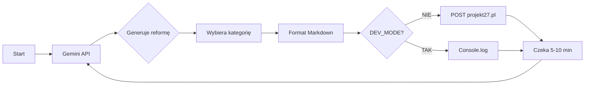

# 🏛️ Generator Reform Prawnych - Projekt27.pl

Automatyczny generator kontrowersyjnych reform prawnych w Polsce wykorzystujący Google Gemini AI i integrację z platformą [projekt27.pl](https://projekt27.pl).

## ✨ Funkcje

- 🤖 **Automatyczne generowanie** reform prawnych przez Gemini AI
- 📂 **Inteligentny dobór kategorii** - AI wybiera odpowiednią kategorię spośród 18 dostępnych
- 📝 **Formatowanie Markdown** - treści w czytelnym formacie z nagłówkami i listami
- ⏰ **Harmonogram** - losowy interwał 5-10 minut między publikacjami
- 🧪 **Tryb developerski** - testowanie bez wysyłania requestów
- 🔄 **Ciągła praca** - działa w tle, automatycznie publikuje

## 📋 Wymagania

- Node.js 18+ (z obsługą ES modules)
- Klucz API Google Gemini ([zdobądź tutaj](https://aistudio.google.com/apikey))
- Konto i token autoryzacyjny z [projekt27.pl](https://projekt27.pl)

## 🚀 Szybki start

1. **Sklonuj repozytorium:**

   ```bash
   git clone https://github.com/qotrek/projekt27-generator.git
   cd projekt27-generator
   ```

2. **Zainstaluj zależności:**

   ```bash
   npm install
   ```

3. **Skonfiguruj zmienne środowiskowe:**

   ```bash
   cp .env.example .env
   ```

4. **Edytuj plik `.env`:**
   - `GEMINI_API_KEY` - Twój klucz API z [Google AI Studio](https://aistudio.google.com/apikey)
   - `PROJECT27_TOKEN` - Token z projekt27.pl (jak go zdobyć - patrz niżej)
   - `MIN_INTERVAL_MINUTES` / `MAX_INTERVAL_MINUTES` - odstęp czasu (domyślnie 5-10 min)

5. **Uruchom aplikację:**
   ```bash
   npm start
   ```

## 🔑 Jak zdobyć token z projekt27.pl

1. Zaloguj się na [projekt27.pl](https://projekt27.pl)
2. Otwórz DevTools (F12)
3. Przejdź do zakładki **Network**
4. Odśwież stronę lub wykonaj akcję (np. wejdź w swoje pomysły)
5. Znajdź request do API (np. `/api/users/me`)
6. W zakładce **Headers** → znajdź `Authorization: Bearer ...`
7. Skopiuj token (długi ciąg znaków po "Bearer ")
8. Wklej do `.env` w `PROJECT27_TOKEN`

## ⚙️ Konfiguracja

### Tryb developerski

W pliku [index.js](index.js) zmień:

```javascript
const DEV_MODE = true; // Symulacja bez wysyłania
const DEV_MODE = false; // Wysyłanie prawdziwych requestów
```

### Interwał czasowy

W pliku `.env`:

```env
MIN_INTERVAL_MINUTES=5   # Minimalny czas oczekiwania
MAX_INTERVAL_MINUTES=10  # Maksymalny czas oczekiwania
```

### Dostępne kategorie

Generator automatycznie wybiera spośród 18 kategorii:

- Deregulacja, Finanse publiczne, Edukacja
- UE i polityka handlowa, Cyfryzacja
- Energetyka, Imigracja, Ochrona zdrowia
- Sprawiedliwość, Infrastruktura i wiele innych...

## 📝 Jak to działa



1. **Generowanie:** Gemini AI tworzy kontrowersyjną reformę prawną
2. **Kategoryzacja:** AI wybiera najlepiej pasującą kategorię z 18 dostępnych
3. **Formatowanie:** Treść w Markdown z nagłówkami, listami i formatowaniem
4. **Publikacja:** Wysyłka na projekt27.pl przez API (lub symulacja w trybie dev)
5. **Harmonogram:** Losowe oczekiwanie 5-10 minut i powtórzenie

## 🛠️ Struktura projektu

```
projekt27-generator/
├── index.js           # Główna logika aplikacji
├── list-models.js     # Skrypt do listowania dostępnych modeli Gemini
├── package.json       # Zależności i konfiguracja
├── .env.example       # Przykładowa konfiguracja
├── .env               # Twoja konfiguracja (nie commitowana!)
├── .gitignore         # Ignorowane pliki
└── README.md          # Ta dokumentacja
```

## 🔧 Troubleshooting

### Błąd: "API key not valid"

- Sprawdź czy klucz Gemini API jest poprawny w pliku `.env`
- Upewnij się, że nie ma spacji przed/po kluczu

### Błąd: "models/gemini-xxx is not found"

- Uruchom `node list-models.js` aby zobaczyć dostępne modele
- Zaktualizuj nazwę modelu w [index.js](index.js) linijka 114

### Błąd 401: "Nie udało się zweryfikować danych uwierzytelniających"

- Token wygasł (sprawdź pole `exp` w JWT - to timestamp)
- Zdobądź nowy token z projekt27.pl (instrukcja powyżej)

### Program się zatrzymuje

Użyj PM2 dla produkcji:

```bash
npm install -g pm2
pm2 start index.js --name projekt27-gen
pm2 logs projekt27-gen
pm2 restart projekt27-gen
```

## 🚦 Uruchamianie w tle

### Linux/Mac

```bash
nohup npm start > output.log 2>&1 &
```

### Windows (PowerShell)

```powershell
Start-Process -NoNewWindow node index.js
```

### Docker (opcjonalnie)

```dockerfile
FROM node:18-alpine
WORKDIR /app
COPY package*.json ./
RUN npm install
COPY . .
CMD ["npm", "start"]
```

```bash
docker build -t projekt27-gen .
docker run -d --env-file .env projekt27-gen
```

## 📊 Przykładowy output

```
🚀 Uruchamiam generator reform prawnych...
⚙️  Interwał: 5-10 minut

🤖 Generuję nową reformę prawną...
📂 Kategoria: Finanse publiczne
✅ Wygenerowano reformę: Podatek Patriotyczny Plus
📤 Wysyłam reformę na projekt27.pl...
✅ Pomyślnie wysłano reformę! Status: 201
🎉 Cykl zakończony sukcesem!

⏰ Następne uruchomienie za 7 minut (14:32:15)
```

## ⚠️ Disclaimer

Ten projekt:

- Generuje **satyryczne/parodystyczne** treści przy użyciu AI
- Służy do celów **edukacyjnych i badawczych**
- **Nie reprezentuje** poglądów autora
- Użytkownik ponosi **pełną odpowiedzialność** za wygenerowane i opublikowane treści

## 🤝 Współpraca

Pull requesty są mile widziane! W przypadku większych zmian, otwórz najpierw issue.

## 📄 Licencja

[MIT](LICENSE)

## 🔗 Linki

- [Projekt27.pl](https://projekt27.pl)
- [Google Gemini AI](https://ai.google.dev/)
- [Google AI Studio - Klucze API](https://aistudio.google.com/apikey)

---

Stworzone z 🤖 przez AI | Powered by Google Gemini
